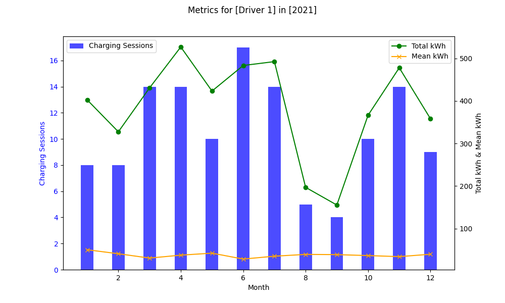
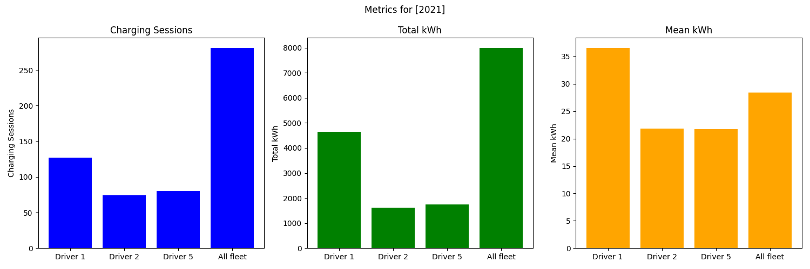

### Analysis of energy used by EV

#### Install dependencies

```shell
pip install -r requirements.txt
```

#### Process input

Process the raw csv input and produce aggregated csv files

```shell
python3 process.py
```

#### Generate charts / more granular overview

Execute [charts.ipynb](charts.ipynb) jupyter notebook manually

##### Example of exported charts

###### Monthly level chart



###### Yearly level chart



#### Before pushing the code

```shell
./format_code.sh
```

---

---

---
